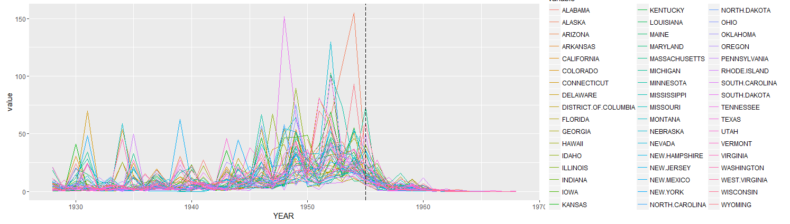

```{r setup, include=FALSE}
knitr::opts_chunk$set(echo = TRUE)
```

##次標題1:資料前處理
```{r}
#讀csv資料
polio<-read.csv("POLIO_Incidence.csv",stringsAsFactors = F)
head(polio)

```

###讀取資料
```{r}
if(!require('reshape')){
  install.packages("reshape")
library(reshape)}
```
###轉換表格
```{r}
#將寬表格轉為長表格，以年(YEAR)/週(WEEK)為基準，各州名column打散變長
polio.m <- melt(polio,id.vars = c('YEAR','WEEK'))
head(polio.m)
library(knitr)
kable(head(polio.m),)
```
| YEAR| WEEK|variable | value|
|----:|----:|:--------|-----:|
| 1928|    1|ALABAMA  |  0.00|
| 1928|    2|ALABAMA  |  0.00|
| 1928|    3|ALABAMA  |  0.04|
| 1928|    4|ALABAMA  |  0.00|
| 1928|    5|ALABAMA  |  0.00|
| 1928|    6|ALABAMA  |  0.00|
###年度發生率
```{r}
polio.m[polio.m$value=="-",]$value<-NA #處理缺值,將"-"轉為NA
polio.m$value<-as.numeric(as.character(polio.m$value)) #將value欄位轉為數字
polio.sumYear<- #各州各年度加總，計算該年度的總發生率
    aggregate(value~YEAR+variable,data=polio.m,FUN=sum,na.rm=F)
head(polio.sumYear)
library(knitr)
kable(head(polio.sumYear),)
```
| YEAR|variable | value|
|----:|:--------|-----:|
| 1928|ALABAMA  |  2.39|
| 1929|ALABAMA  |  2.25|
| 1930|ALABAMA  |  2.57|
| 1931|ALABAMA  |  2.07|
| 1932|ALABAMA  |  1.38|
| 1933|ALABAMA  |  1.12|


##次標題2:視覺化呈現
```{r}
if(!require('ggplot2')){
  install.packages("ggplot2")
library(ggplot2)}
```
1.選取圖形種類:大致上可分為數種，有長條圖、點狀圖、折線圖、盒須圖、面積圖等，但根據這次的資料量有42年及51個州，數量就高達2142筆資料量，若採取長條圖則只會呈現以州為X軸及發生率為Y軸共2142個長條資料，若改為以年分為X軸及發生率為Y軸也會呈現51條長條資料，但長條會互相覆蓋，故不使用此圖。若採取點狀圖更是自找苦吃，有多達2142個點，看不出年份增加的變化。若採取何須圖亦看不出個所以然。面積圖亦是如此，最後一個:折線圖，因為資料的高低導致圖形的劇烈變化，鋒銳的頂點更能給人不安的感覺，到最後有施打疫苗時，顯而易見的看出變化不在劇烈，所以最後決定以折線圖最能判別出總結!
```{r,fig.height=4}
ggplot(polio.sumYear)+ #資料為polio.sumYear
    geom_line(aes(x=YEAR,y=value,color=variable))+ #geom_line:畫折線圖
    geom_vline(xintercept = 1955,colour="black", linetype = "longdash")#疫苗
```

4.根據此圖，可看出在尚未施打疫苗之前的發生率是多麼不穩定且高居不下，但到了1955年施打後明顯改善，導致幾乎各州的資料value都重疊再一起，機率變得相當低，疫苗的效果十分顯著!